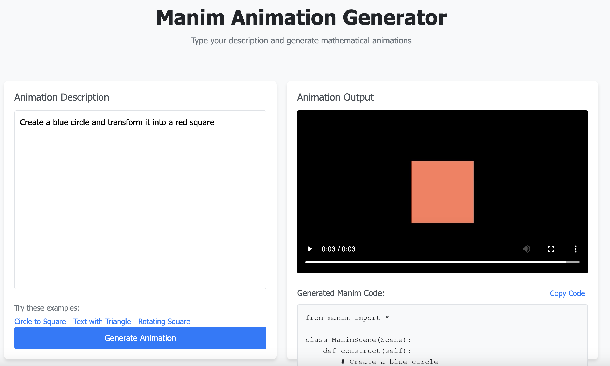

# Manim Animation Generator

A web application that generates mathematical animations using Python and the Manim library. Users can type natural language descriptions of animations, and the application will generate and display the corresponding animation.

## Features

- **Simple Text-to-Animation Interface**: Type what you want to see, get an animation
- **Low-Quality Preview**: Fast rendering for quick feedback
- **Code Display**: View the generated Manim code for learning or further customization
- **Minimalist Design**: Clean, two-pane interface for easy use

## Screenshots



## Requirements

- Python 3.10+
- Flask
- Manim
- FFmpeg
- Cairo, Pango, and other Manim dependencies

## Installation

### System Dependencies

First, install the required system dependencies:

```bash
sudo apt-get update
sudo apt-get install -y build-essential python3-dev python3-pip ffmpeg \
    libcairo2-dev libpango1.0-dev libjpeg-dev libgif-dev librsvg2-dev \
    python3-setuptools meson ninja-build
```

### Python Dependencies

Install the required Python packages:

```bash
pip3 install pycairo
pip3 install manim openai flask
```

### Clone the Repository

```bash
git clone https://github.com/yourusername/manim-animation-generator.git
cd manim-animation-generator
```

## Usage

### Running the Application

Start the application with:

```bash
python3 app.py
```

By default, the application runs on port 8000. You can specify a different port with:

```bash
python3 app.py --port 8080
```

The application will automatically find an available port if the specified one is in use.

### Accessing the Application

Open your web browser and navigate to:

```
http://localhost:8000
```

### Creating Animations

1. Enter a description of the animation you want to create in the left pane
2. Click the "Generate Animation" button
3. Wait for the animation to be generated (this may take a few seconds)
4. View the animation in the right pane
5. Optionally, copy the generated Manim code for further customization

### Example Descriptions

Here are some example descriptions you can try:

- "Create a blue circle and transform it into a red square"
- "Write the text 'Hello, Manim!' and fade in a green triangle below it"
- "Draw a square, rotate it, and then fade it out"

## API Documentation

The application provides a RESTful API for generating animations programmatically.

### Endpoints

#### Health Check

```
GET /api/health
```

Returns the status of the API.

**Response:**
```json
{
  "status": "ok",
  "message": "Manim app backend is running"
}
```

#### Generate Animation

```
POST /api/generate
```

Generates an animation from a text description.

**Request Body:**
```json
{
  "description": "Create a blue circle"
}
```

**Response:**
```json
{
  "status": "success",
  "job_id": "550e8400-e29b-41d4-a716-446655440000",
  "video_url": "/api/video/550e8400-e29b-41d4-a716-446655440000",
  "code": "from manim import *\n\nclass ManimScene(Scene):\n    def construct(self):\n        # Create a circle\n        circle = Circle(color=BLUE)\n        self.play(Create(circle))\n        self.wait(1)"
}
```

#### Get Video

```
GET /api/video/<job_id>
```

Returns the generated video file.

#### Check Job Status

```
GET /api/status/<job_id>
```

Checks the status of a job.

**Response:**
```json
{
  "status": "completed",
  "video_url": "/api/video/550e8400-e29b-41d4-a716-446655440000"
}
```

## Architecture

The application consists of two main components:

1. **Backend**: A Flask application that handles API requests, generates Manim code from text descriptions, and runs Manim to create animations.
2. **Frontend**: A simple HTML/CSS/JavaScript interface that allows users to enter descriptions and view the resulting animations.

### Directory Structure

```
manim_app/
├── app.py                  # Main application entry point
├── backend/                # Backend API code
│   ├── __init__.py         # Backend initialization
│   └── api.py              # API endpoints and Manim code generation
├── static/                 # Static assets
│   ├── css/                # CSS styles
│   │   └── styles.css      # Main stylesheet
│   └── js/                 # JavaScript code
│       └── main.js         # Main frontend logic
├── templates/              # HTML templates
│   └── index.html          # Main application page
├── utils/                  # Utility scripts
│   └── temp/               # Temporary files for Manim scripts
└── media/                  # Generated media files
    └── videos/             # Output video files
```

## Advanced AI Integration

The application now integrates with Google's Gemini 2.5 Pro API for enhanced text-to-code conversion capabilities. This integration enables:

- **Complex Animation Generation**: Create sophisticated animations from simple descriptions
- **3D Scene Support**: Generate 3D scenes and objects with proper camera settings
- **Mathematical Equation Rendering**: Create animations with complex mathematical equations

For more details, see the [Gemini Integration Documentation](docs/gemini_integration.md).

## Future Improvements

- Fine-tune the Gemini model specifically for Manim code generation
- Implement user accounts and saved animations
- Add a gallery of example animations
- Support for higher quality rendering options
- Add interactive refinement of generated animations

## License

This project is licensed under the MIT License - see the LICENSE file for details.

## Acknowledgments

- [Manim](https://github.com/ManimCommunity/manim) - The mathematical animation engine
- [Flask](https://flask.palletsprojects.com/) - The web framework used
- [3Blue1Brown](https://www.3blue1brown.com/) - For creating Manim and inspiring this project
